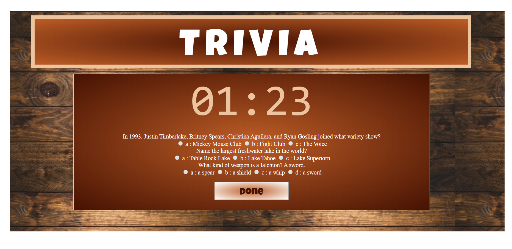

# TriviaGame
Trivia Game where the player has 1:40 seconds to answer random questions. making use of moments.js. and jquery. 

# Link 
https://jonfinley211.github.io/triviagame/

## Original Inspiration
This site provides a quiz for most anything and gives shows incorrect answer.

## Technology Used
- jQuery 
- Moments.js
- Bootstrap
- Reset.css

How to Install
- Clone Repository
- Npm Install
- Open in Browser

## Future Goals
- save times
- set up a user name 
- set up data base for questions and users. 
- use storage to ask the missed questions again. 

## Checkout my Projects 
https://jonfinley211.github.io/portfolio/

